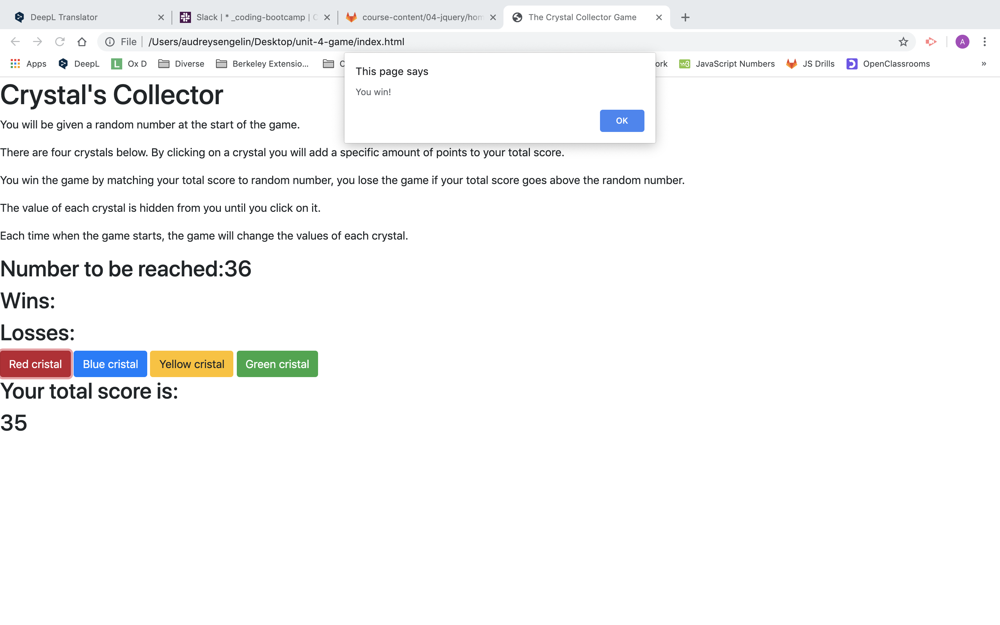

# unit-4-game

## Image
Site img

## Summary
I created a game where the player has to guess the answer, just like in Word Guess. This time, though, the player will guess with numbers instead of letters.

## Steps
First, I wrote a pseudocode, to detail the different steps apart on a paper.

I created a repository on GitHub and my different files (html, CSS, and Javascript) on my Terminal.

I linked the differents files and added a ready function to my JavaScript file to ensure it won't get run until my html is finished loading.

In my html, I used bootstrap to create four different buttons.

Then, I created three different variables to set my scores.

I used a variable to generate the random number between 19 and 120 which will be the number to reach.

I also use the Math.floor(Math.random) function to give each button a different value between 1 and 12. The value of the first button, though, will be set at 1.

Four onclick functions are set to add to the total score the value of each button on each click.

On each of these on click functions, I added two conditionals to increase the wins and losses each time the payer either succeed in reaching the number or exceeds it.

Finally, I wrote two functions with alerts so that each time the player wins or losses, a message is displayed and a new random number to guess is given.

Each time I made changes to the local repository, I pushed them to GitHub.

I deployed my site by using GitHub pages to create a live site.

## Technologies used
HTML
CSS
Bootstrap
JavaScript
jQuery
Git
GitHub

## Author Links
[GitHub](https://github.com/AudreySen)
